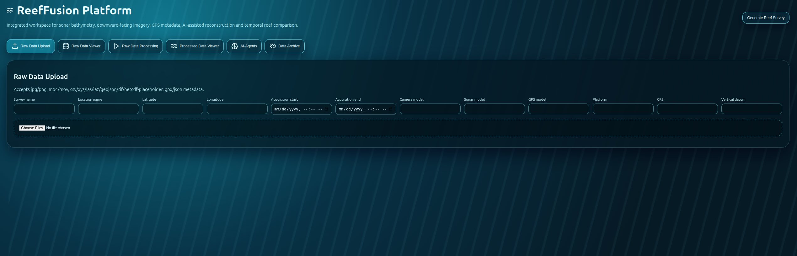
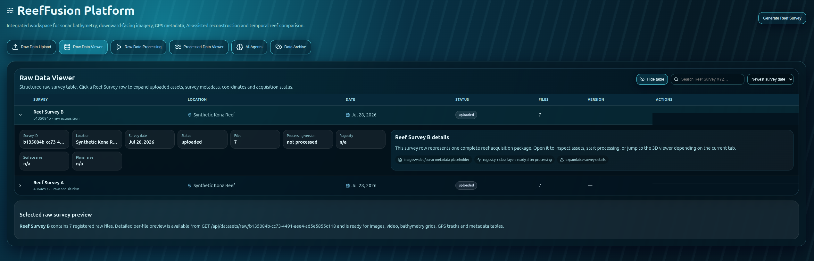
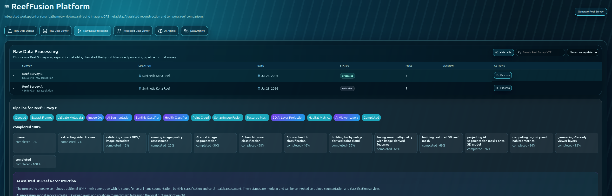
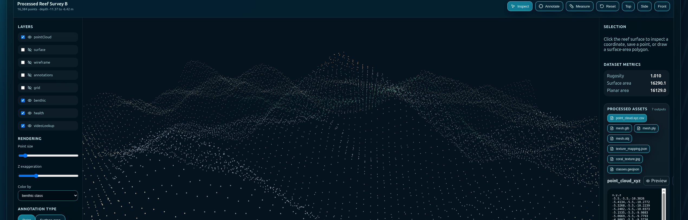
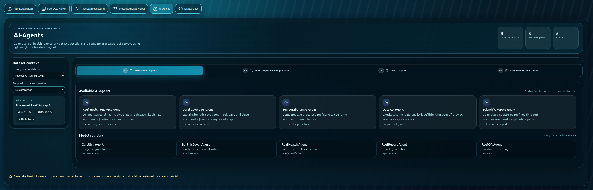
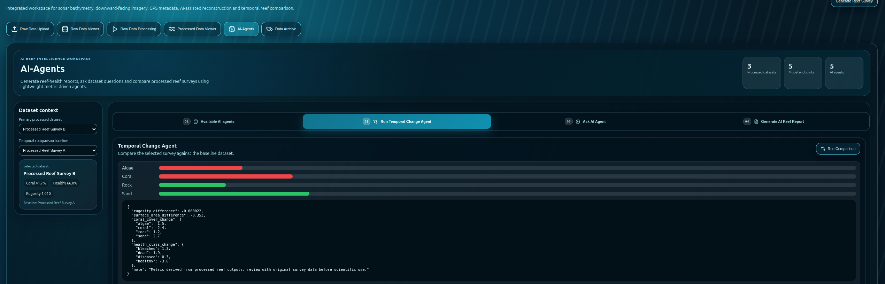
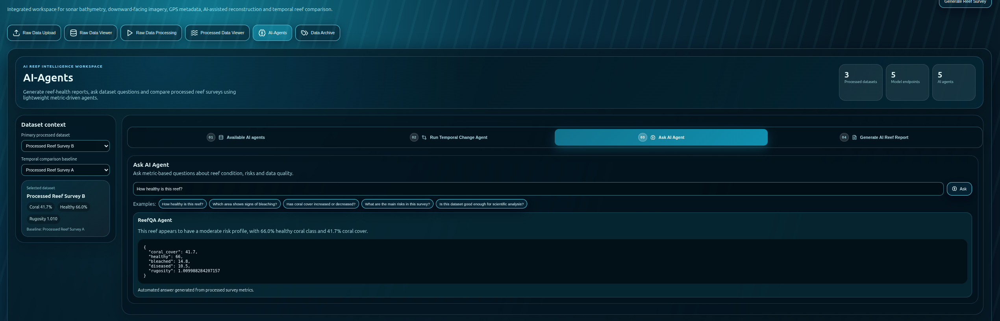
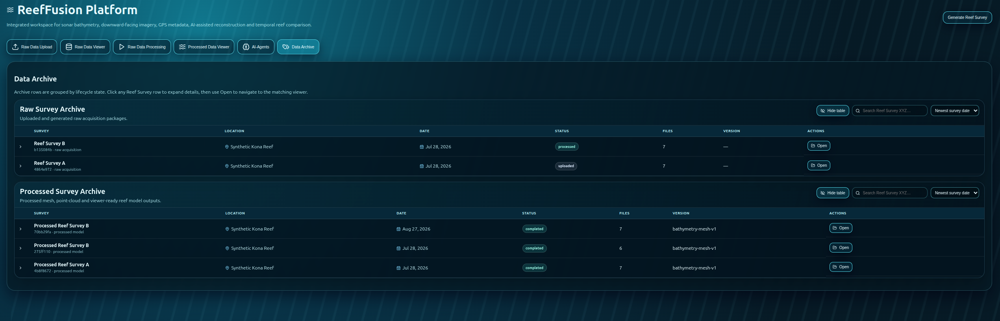

# ReefFusion Platform POC

ReefFusion is a local, Docker Compose based proof-of-concept for fusing sonar/bathymetry, downward-facing underwater imagery/video, and GPS/geolocation metadata into a browser-viewable 3D reef survey workspace.

## Run

```bash
cp .env.example .env
docker compose up --build
```

Open:

- Frontend: http://localhost:3000
- Backend API: http://localhost:8000
- OpenAPI docs: http://localhost:8000/docs
- MinIO console: http://localhost:9001 (`minioadmin` / `minioadmin`)

## What works in this POC

- Generate synthetic paired reef surveys: timepoint A and B.
- Upload raw files.
- List and inspect raw datasets.
- Start a processing job with visible pipeline progress.
- Produce deterministic mock point cloud / mesh placeholder assets.
- Visualize a browser point cloud in React Three Fiber.
- Compute global and local rugosity from a synthetic bathymetry grid.
- Store metadata, datasets, jobs and annotations in PostgreSQL/PostGIS-ready database.
- Store raw and processed objects in MinIO.
- Create/edit/delete annotation records through the API.
- Compare two processed datasets and report approximate change metrics.
- Expose a modular ML registry placeholder for Year 2.


## Useful commands

```bash
# run backend tests locally inside the backend image
docker compose run --rm backend pytest -q

# apply database migrations explicitly
docker compose run --rm backend python -m app.ops.migrate

# seed repeatable synthetic demo datasets
docker compose run --rm backend python -m app.ops.seed

# recreate the seeded demo datasets and clean their stored objects
docker compose run --rm backend python -m app.ops.seed --force

# inspect logs
docker compose logs -f backend worker

# reset local data
docker compose down -v
```

## Ops notes

- Schema changes are managed through Alembic migrations in `backend/alembic/versions`; app startup also runs `alembic upgrade head`.
- Test helpers for deterministic sample survey data live in `backend/app/testing/fixtures.py`.
- Dataset delete endpoints remove database rows and matching MinIO objects:
  - `DELETE /api/datasets/raw/{dataset_id}`
  - `DELETE /api/datasets/processed/{dataset_id}`
- Auth is disabled for the local demo. To require API tokens for mutating operations, set `AUTH_ENABLED=true` and configure `AUTH_ADMIN_TOKEN` / `AUTH_EDITOR_TOKEN`. Use `Authorization: Bearer <token>` or `X-API-Key: <token>`.
- GitHub Actions runs backend tests and the frontend build from `.github/workflows/ci.yml`.

## Limitations

Synthetic outputs are designed for product and architecture validation only. They are not scientifically valid reef measurements. Real SfM, sonar calibration, geodetic transformations, sensor synchronization, underwater camera calibration, refraction correction, uncertainty estimation and QA/QC need to be added before operational scientific use.

## Enhanced 3D Model Viewer

The Processed Data Viewer and Annotation tabs include an interactive React Three Fiber viewer for working with processed 3D reef outputs.

Supported POC viewer functions:

- orbit / pan / zoom navigation
- reset, top, side and front camera presets
- point cloud and triangulated surface rendering
- wireframe overlay
- grid/reference layer
- adjustable point size and vertical exaggeration
- depth, benthic-class and health-class color modes
- x/y/depth picking on the reef surface
- approximate two-point 3D measurement mode
- direct point annotation creation on the 3D model
- annotation marker rendering, selection and deletion
- rugosity / surface metric display next to the model

The viewer currently consumes the generated `point_cloud.xyz.csv` asset and builds a lightweight browser mesh for the demo. In a production integration, the same viewer shell can load real GLB/PLY/3D Tiles assets exported from COLMAP/OpenMVG/OpenMVS and sonar meshing tools.

## Enhanced interactive survey tables

The Raw Data Viewer, Raw Data Processing and Data Archive tabs now use structured interactive tables instead of simple cards. Each row represents a `Reef Survey XYZ` survey package and includes survey name, location, date, status, file count, processing version and contextual actions.

Table capabilities:

- Search/filter surveys by name, status, location or version.
- Sort by newest date, survey name, status or file count.
- Click any survey row to expand a detail panel.
- Expanded rows show survey ID, location, date, status, file count, processing version, rugosity and surface metrics where available.
- Raw Data Processing rows include a `Process` action that starts the backend processing job.
- Data Archive has separate raw and processed archive tables and `Open` actions for the matching viewer.

This keeps demo datasets such as `Reef Survey A`, `Reef Survey B` or uploaded survey packages visually organized and closer to a production data-management workflow.

## AI-Agents tab structure

The AI-Agents workspace is organized into three sub-tabs:

- Data set selection: choose the primary processed dataset and optional temporal baseline, then review available AI agents and the model registry.
- Generate AI Reef Report: generate a structured reef-health report and optional temporal change output.
- Ask AI Agent: ask dataset-specific questions and review metric-backed answers.


## Screenshots









