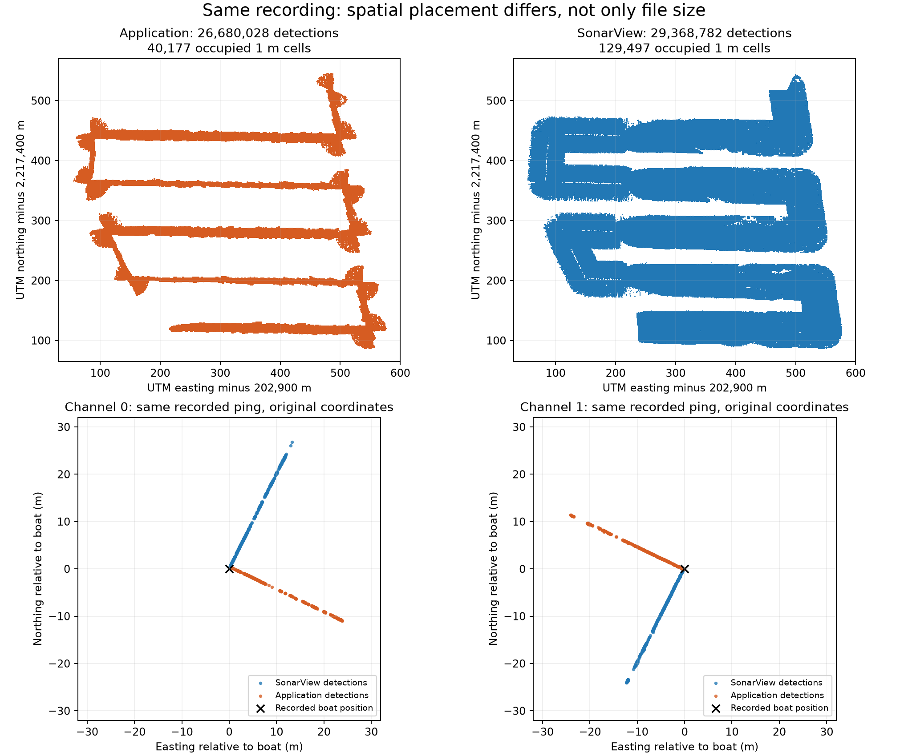
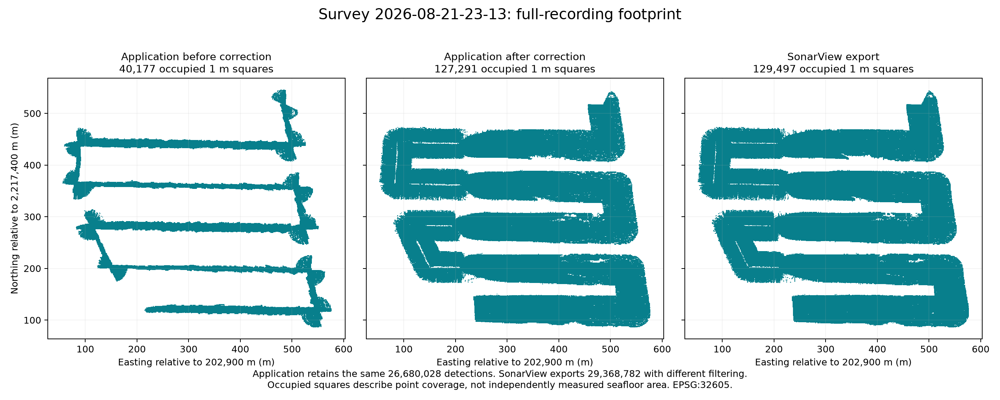

# Survey export and swath comparison

Recording: `2026-08-21-23-13.svlz`. Audit date: 2026-09-30.

## Initial finding

The application and SonarView exports differ in spatial placement, not just CSV formatting. The application's point swaths run approximately along the boat's travel direction, while SonarView's run across it. This discrepancy is already present in the application's raw XYZ export, before mesh reconstruction or browser rendering.

The evidence strongly indicates an error in the application's device-to-navigation horizontal coordinate transformation. Both inspected channels exhibit an approximately 89.028 degree XY rotation relative to SonarView. This matches a 90 degree device-axis discrepancy combined with the local UTM meridian convergence of approximately -0.972089 degrees. This was the initial diagnosis; the validated correction and rollout are recorded below.

## Complete-file statistics

| Measurement | Application | SonarView |
|---|---:|---:|
| Bytes | 1,321,637,205 | 4,233,511,217 |
| Data columns | 3 | 15 |
| Detection rows | 26,680,028 | 29,368,782 |
| Occupied 1 m XY cells | 40,177 | 129,497 |
| East-west extent | 519.492 m | 523.676 m |
| North-south extent | 459.641 m | 457.325 m |

The application has 2,688,754 fewer rows (9.16% fewer than SonarView). SonarView includes extra metadata columns, so byte size is not a point-count measure. The overall bounding boxes are similar because the vessel covers the same route; they conceal the much narrower footprint along straight survey lines.

The 1 m cells are occupied projected grid squares, not an independently verified seafloor surface-area measurement. They were computed from every finite XYZ row, without sampling. Even SonarView classification 1 alone occupies 117,697 cells, so inclusion of its other classifications does not explain the footprint difference.

## Matched-ping evidence

The original stored recording was inspected read-only. Coordinates calculated with the application's current formula reproduce its first 777 CSV rows to within 5e-10 m. For the same pings in SonarView, candidate detections were associated using rounded power (within 0.05001 dB) and non-MSL altitude (within 0.05 m). Only detections retained by the application were considered. A rigid XY fit was used, candidates with residual over 0.5 m were excluded, and the fit was repeated. Rounded power/depth cannot uniquely identify every detection; these are consistent candidate matches, not a claim that all points have unique identifiers.

| Channel / ping | Consistent pairs | Fitted XY rotation | Median original XY difference | Median residual after fit |
|---|---:|---:|---:|---:|
| 0 / 129924 | 261 | 89.027764 degrees | 12.652 m | 0.0053 m |
| 1 / 129929 | 295 | 89.027672 degrees | 12.487 m | 0.0036 m |

The fit includes translation as well as rotation. Height differences for these matched points are about 2 cm; the important footprint error is horizontal. The two-channel check covers the first ping from each channel, not every ping in the recording. The full-survey occupancy plot independently demonstrates the same narrowed-track pattern.

## Filtering is a separate difference

The application currently uses the recorded medium power threshold, rejects raw classification 2 and nonnegative vehicle-relative Z, and applies range/navigation validity checks. SonarView exports classifications 1, 2 and 5 in this file. The raw packets inspected here label detections as unclassified, so SonarView's exported classification labels must not be assumed identical to the raw packet's labels. The complete 2.69-million-row difference has not yet been attributed detection by detection.

The published protocol documents the device coordinate frame, beam-angle direction and three power thresholds: [Omniscan3D message definitions](https://docs.bluerobotics.com/ping-protocol/pingmessage-omniscan3d/).

## Recommended correction sequence

1. Correct and validate the device-axis/heading and true-north-to-UTM transformations against pings from both channels at several headings and depths. Check the small vertical-offset discrepancy separately.
2. Add independent regression fixtures using known coordinates from the supplied SonarView export, rather than checking the shared decoder against itself.
3. Decide and document the desired detection-filter policy separately from the geometry correction.
4. Version and invalidate affected replay/export caches; regenerate affected processed cells from the saved originals. Reprocessing with the current decoder would reproduce the error. Original recordings do not need to be uploaded again.

No application code, original recording, supplied CSV or processed survey asset was changed during this audit. The local scripts and JSON/NPZ files in this directory preserve the analysis inputs and results.

## Implemented correction and pilot validation

The subsequent approved implementation corrects the device yaw frame and projects
true north/east displacements into UTM through WGS84 geodesic endpoints. The
original CSVs and recordings remain unchanged. Coordinate version 2 distinguishes
corrected replay, export and processed data from the retained legacy generation.

The pilot completed with 26,680,028 detections, unchanged from the previous XYZ
export, and 90/90 processed cells (previously 71). The full detection footprint
occupies 127,291 one-metre squares; SonarView occupies 129,497. Their intersection
contains 126,743 squares, giving intersection-over-union **97.46%**, up from
**29.37%** before correction. This compares point occupancy, not seafloor area.

Independent validation sampled 20 pings across both channels and ten heading
bands. Nineteen pings provided 6,683 confident power/depth associations; every
associated XY difference was below 10 cm, without fitting or translating XY.
The per-ping 95th percentile ranged from approximately 5 mm to 93 mm. One ping
could not be associated confidently and is excluded, rather than treated as a
passing measurement. To identify detections despite different vertical lever-arm
conventions, matching estimates the dominant within-ping depth difference from
power-compatible candidates, then requires reciprocal uniqueness within 2 mm of
that depth difference. This affects association only: output Z is not adjusted.

The 500,023,701-byte pilot recording was decoded through disk-backed 1 m bins;
the worker used about 148 MiB during decoding and peaked at **300 MiB** during
surface processing. Rejection counters report 4,644,446 detections below medium
power and 168,953 with nonnegative vehicle-relative depth. SonarView filtering
remains different; the implementation deliberately preserves existing filters.

Corrected cells were staged separately and activated together. Previous surfaces
and annotations remain available as legacy entries. See
`corrected-heading-validation.json` and `corrected-coverage-comparison.json` for
machine-readable evidence.

## Completed rollout and download verification

| Recording | Recovered detections | New cells | Processed surfaces | Status |
|---|---:|---:|---:|---|
| 2026-08-21-23-13 | 26,680,028 | 90 | 90 | Complete |
| 2026-08-21-20-15 | 25,951,295 | 84 | 82 | Partial: one unmatched point packet |
| 2026-07-10-20-00 | 3,283,621 | 66 | 65 | Partial: damaged compressed ending |

The three cells without surfaces retain measurements and full detection coverage;
they have too few points spread across both axes for surface reconstruction.
No active derived views refer to retired source generations.

The corrected pilot CSV was verified through the live backend download endpoint:
HTTP 200, **26,680,028 actual data rows**, **1,321,637,286 bytes**, EPSG:32605,
coordinate version 2, `partial=false`, and unchanged
`vehicle_origin_uncorrected` vertical datum. The entire response was counted
streamingly, without loading it into memory. Existing files in Downloads were
not overwritten; use the archive download to obtain corrected coordinates.

Validation: 141 backend tests and 73 frontend tests pass; the frontend production
build passes. The two partial statuses are original recording limitations and
remain visible rather than being reported as complete recordings.
